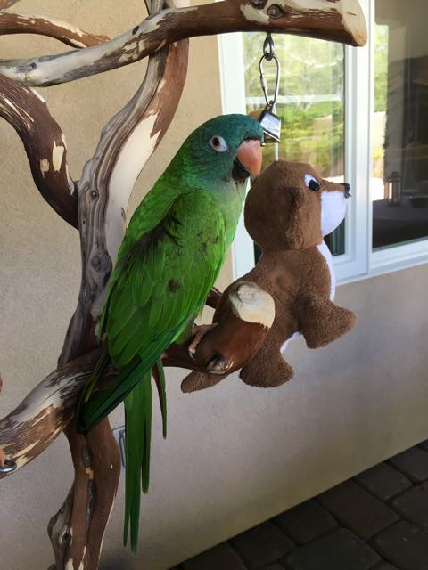

# relative-image-url
The Stack Overflow question that I found asking if relative image links were supported said "No", but it's more complicated.

It works for jpg's:

    

But it doesn't work for svg's:
    
       

